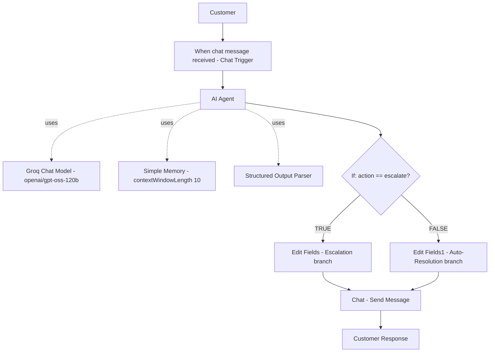

# Architecture

## Diagram

## Node-by-Node Explanation

| Node | Type | Role |
|---|---|---|
| **When chat message received** | `@n8n/n8n-nodes-langchain.chatTrigger` | Entry point; captures the customer's chat message and session ID. `responseMode: responseNodes`. |
| **AI Agent** | `@n8n/n8n-nodes-langchain.agent` | Core reasoning node. Runs the system prompt against the customer's message, using the Groq model, memory, and structured output parser. `hasOutputParser: true`. |
| **Groq Chat Model** | `@n8n/n8n-nodes-langchain.lmChatGroq` | Supplies the LLM (`openai/gpt-oss-120b`) to the AI Agent via the `ai_languageModel` connection. Credential: `Groq account 2` (referenced by name only). |
| **Simple Memory** | `@n8n/n8n-nodes-langchain.memoryBufferWindow` | Stores the last 10 messages of the conversation (`contextWindowLength: 10`), connected via `ai_memory`, keyed to the Chat Trigger session. |
| **Structured Output Parser** | `@n8n/n8n-nodes-langchain.outputParserStructured` | Forces the AI Agent's output into a fixed JSON schema (`category`, `urgency`, `sentiment`, `action`, `response`, `reason`), connected via `ai_outputParser`. |
| **If** | `n8n-nodes-base.if` | Routes execution based on `{{ $json.action }} == "escalate"`. |
| **Edit Fields** | `n8n-nodes-base.set` | **Escalation branch.** Builds: `ticket_status="Escalated"`, `category`, `urgency`, `sentiment`, `customer_response`, `escalation_reason`, `ticket_id="TICKET-"+Date.now()`. All values pulled from `$json.output.*`. |
| **Edit Fields1** | `n8n-nodes-base.set` | **Auto-resolution branch.** Builds: `ticket_status="Auto-Resolved"`, `category`, `urgency`, `sentiment`, `customer_response`, `resolution_reason`. All values pulled from `$json.output.*`. |
| **Chat** | `@n8n/n8n-nodes-langchain.chat` | Final response node; sends `{{ $json.customer_response }}` back to the customer in the n8n chat interface. |

## Data Flow
1. `When chat message received` emits the raw chat input and session ID.
2. `AI Agent` produces a single structured object nested at `$json.output`, containing `category`, `urgency`, `sentiment`, `action`, `response`, `reason` — enforced by the `Structured Output Parser`.
3. `If` reads `$json.action` (from the parsed output) to decide the branch.
4. Both `Edit Fields` and `Edit Fields1` read from `$json.output.*` to build a flat, consistent record (`includeOtherFields: true` preserves the rest of the item).
5. Both branches converge into the single `Chat` node, which always sends `$json.customer_response` — so the customer always receives a natural-language reply regardless of which branch was taken.

## Design Notes
- The **Groq Chat Model**, **Simple Memory**, and **Structured Output Parser** are all sub-inputs of the `AI Agent` node (LangChain sub-node pattern) rather than sequential steps in the main data path — this is why they appear as separate boxes but do not sit "in line" on the main connection chain.
- Using a **Structured Output Parser** instead of free-text parsing (e.g., a Code node with regex) makes the downstream `If` and `Edit Fields` nodes reliable, since they can reference fixed field names (`$json.output.category`, etc.) instead of parsing unpredictable text.
- Both routing branches converge on one `Chat` node, keeping a single source of truth for what is actually sent to the customer.
